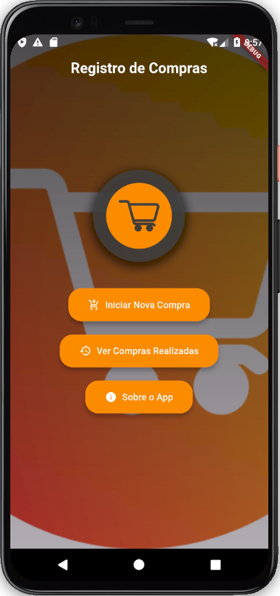
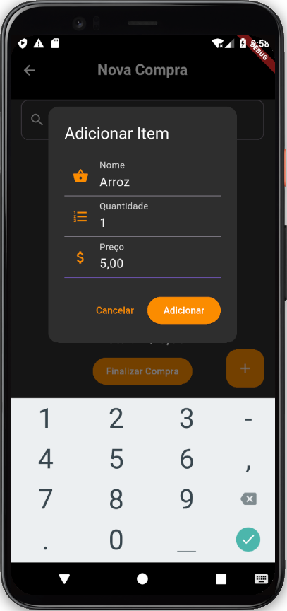
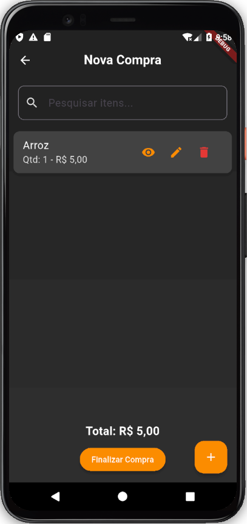
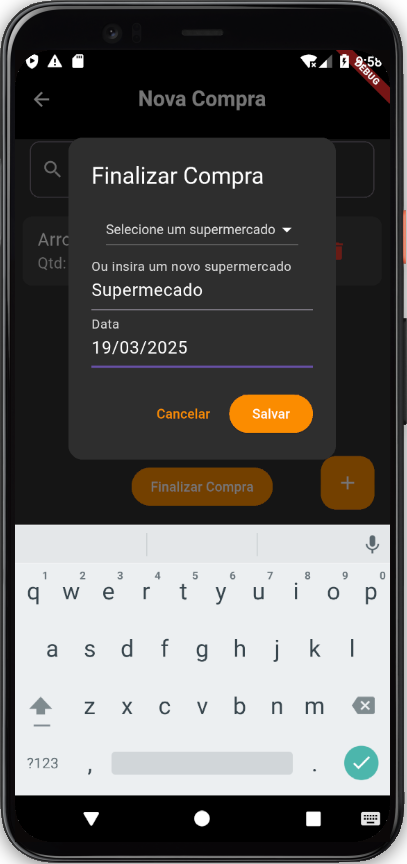
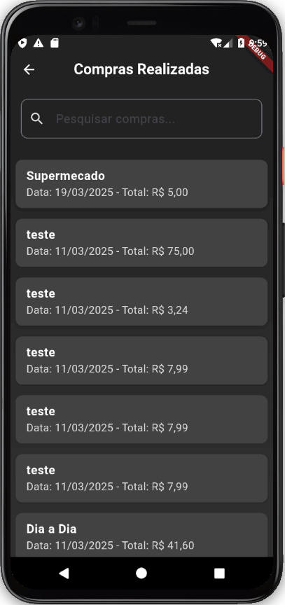
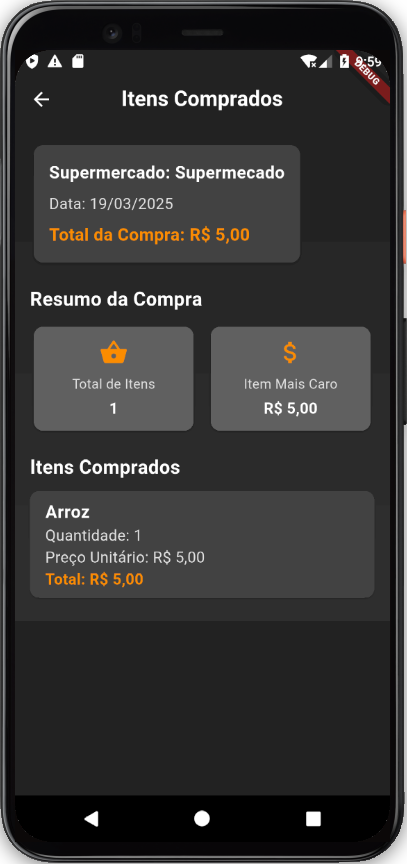

📌 Registro de Compras

Gerencie suas compras com praticidade e evite surpresas no caixa! 🚀

O Registro de Compras é um aplicativo intuitivo e eficiente para acompanhar seus gastos no supermercado. Com ele, você mantém controle total sobre seus itens e valores, garantindo um planejamento financeiro mais inteligente e tranquilo.

✨ Funcionalidades Principais

✅ Registro Rápido de Itens: Adicione produtos à sua lista de forma simples e prática.

💰 Cálculo Automático: Veja o valor total das suas compras atualizado em tempo real.

📊 Histórico de Compras: Acompanhe suas compras anteriores para um melhor planejamento financeiro.

🕵️ Modo Oculto: Oculte itens sem excluí-los para manter sua lista organizada.

🎨 Interface Moderna: Design intuitivo e agradável para uma experiência fluida.

## 📱 Como Usar

### Tela Inicial
  

### Adicionar Itens ➕

Toque no botão + para incluir produtos na sua lista.
  

### Acompanhar o Total 👀 acompanhar_o_total

O valor total será atualizado automaticamente conforme você adiciona ou remove itens.
  

### Finalizar a Compra 🛒

Informe o nome do mercado e a data para registrar sua compra.

  

### Revisar o Histórico 📂

Consulte compras anteriores para um controle financeiro mais eficiente.
  

### Itens Comprados 📂

Consulte compras anteriores para um controle financeiro mais eficiente.
  

🛠️ Tecnologias Utilizadas

🚀 Flutter - Framework para desenvolvimento multiplataforma.

🏆 Dart - Linguagem de programação utilizada.

🔄 Provider - Gerenciamento de estado eficiente.

🗄️ SQLite - Banco de dados local para armazenamento das compras.

✨ Google Fonts - Personalização de fontes para um visual mais moderno.

▶️ Como Executar o Projeto

# Clone o repositório
git clone https://github.com/c-o-s-m-o/registro_de_compras.git

# Navegue até o diretório do projeto
cd registro_de_compras

# Instale as dependências
flutter pub get

# Execute o aplicativo
flutter run

