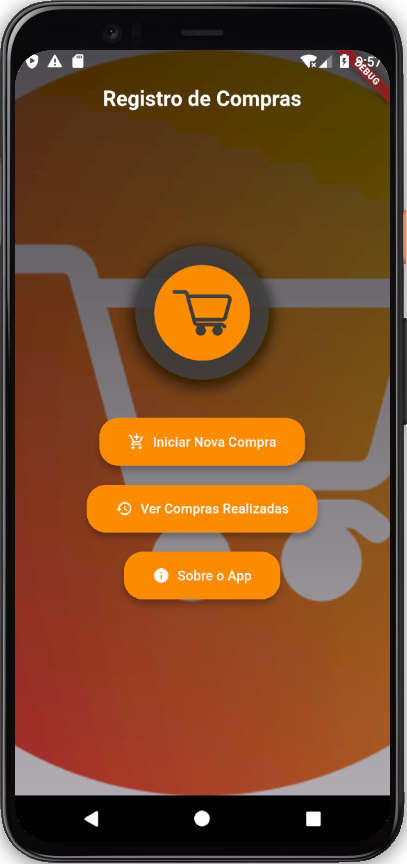
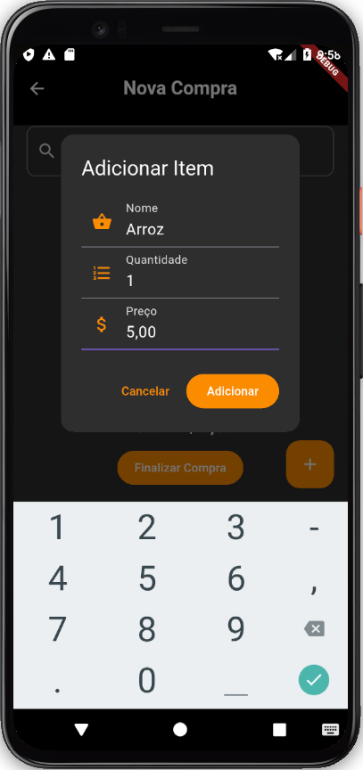
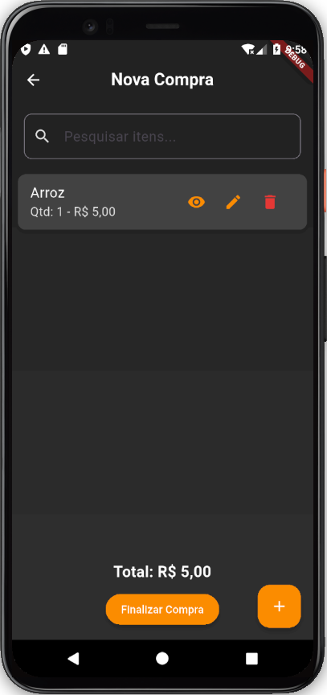
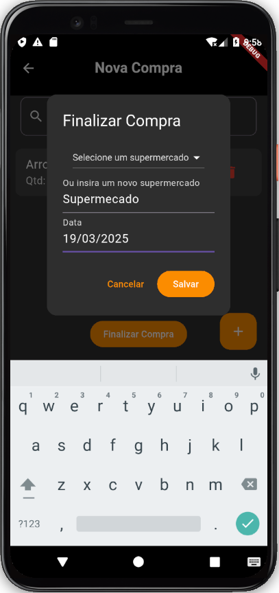
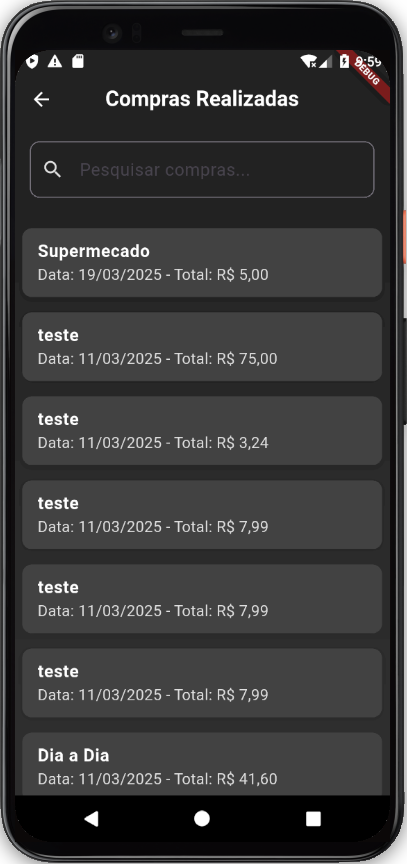
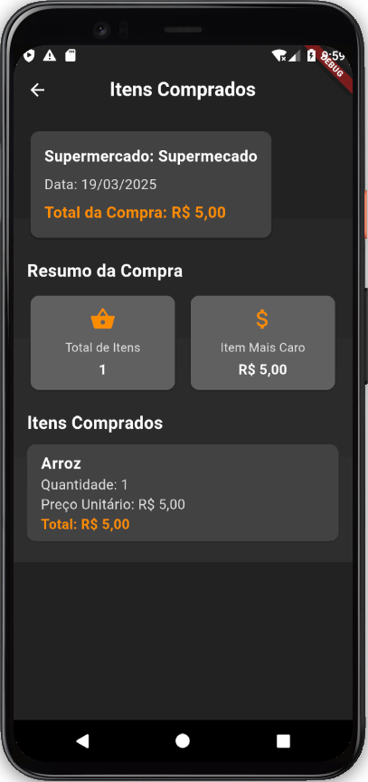
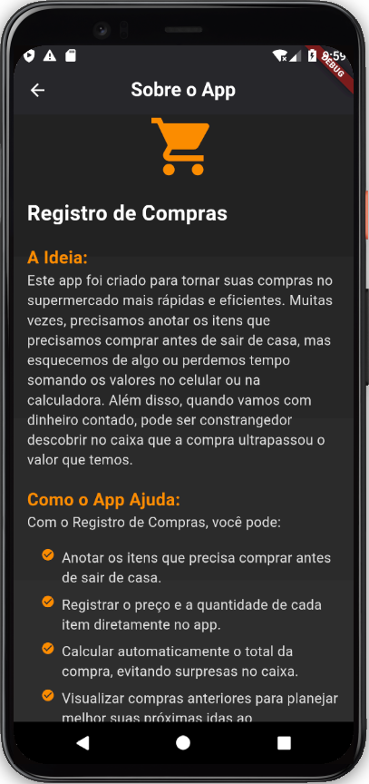

# Registro de Compras

Aplicativo Flutter para acompanhar compras de supermercado em tempo real, registrar itens e valores, calcular o total antes do caixa e manter histórico de compras realizadas.

> **Status:** projeto funcional de portfólio mobile, mantido como demonstração de Flutter, gerenciamento de estado e persistência local.

## Problema que o projeto resolve

Durante uma compra, é fácil perder a noção do valor acumulado no carrinho. O aplicativo foi criado para permitir o registro rápido dos itens e mostrar o total atualizado enquanto a compra acontece.

## Funcionalidades

- cadastro de itens e respectivos valores;
- cálculo automático do total da compra;
- ocultação de itens sem exclusão definitiva;
- finalização da compra com mercado e data;
- histórico de compras realizadas;
- consulta dos itens de uma compra anterior;
- persistência local dos dados;
- interface adaptada ao uso em smartphone.

## Stack

- Flutter
- Dart
- Provider — gerenciamento de estado
- SQLite / Sqflite — persistência local
- Moor
- Intl
- Google Fonts
- Path Provider

## Demonstração

### Tela inicial


### Adicionar itens


### Total em tempo real


### Finalizar compra


### Histórico


### Detalhes da compra


### Sobre o aplicativo


## Execução local

```bash
git clone https://github.com/c-o-s-m-o/registro_de_compras.git
cd registro_de_compras
flutter pub get
flutter run
```

## Pontos de engenharia demonstrados

- gerenciamento de estado com Provider;
- persistência local;
- modelagem de dados de compra;
- atualização reativa da interface;
- organização de fluxo mobile;
- tratamento de histórico e detalhes de registros.

## Evolução recomendada

- ampliar testes unitários e de widgets;
- documentar a estrutura interna do projeto;
- revisar e simplificar a camada de persistência;
- adicionar filtros e busca no histórico;
- adicionar exportação de compras;
- documentar builds Android/iOS.

## Autor

**Emanuel Cosmo**
